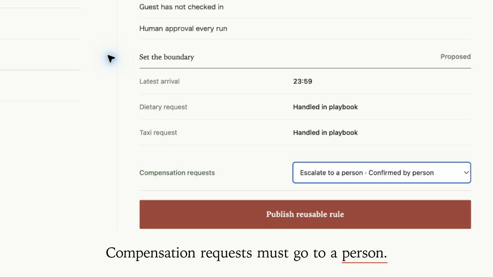
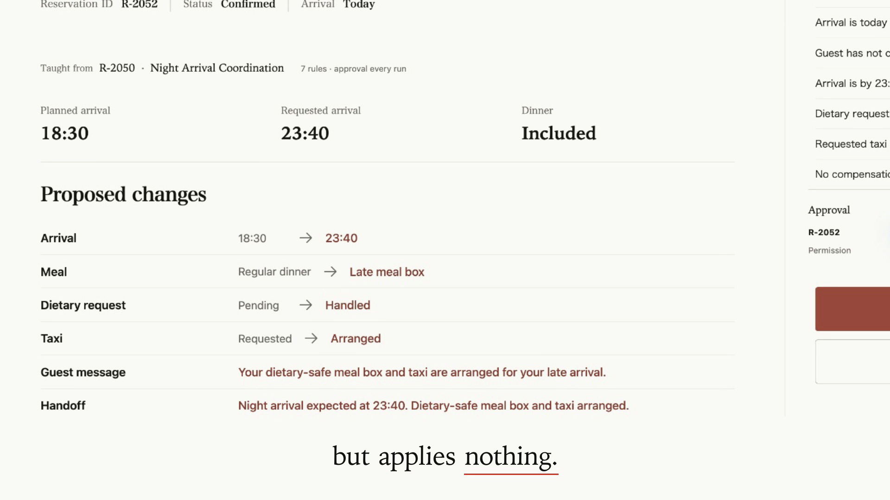
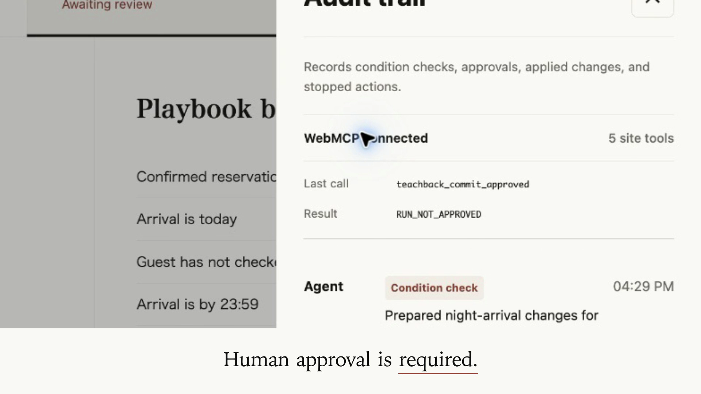
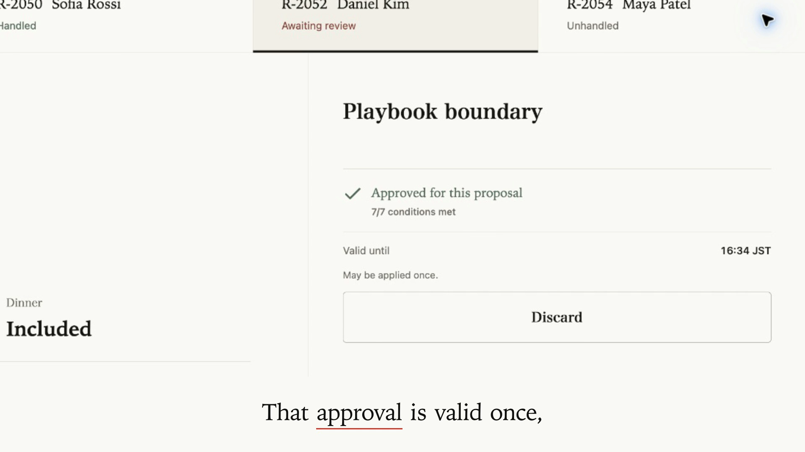
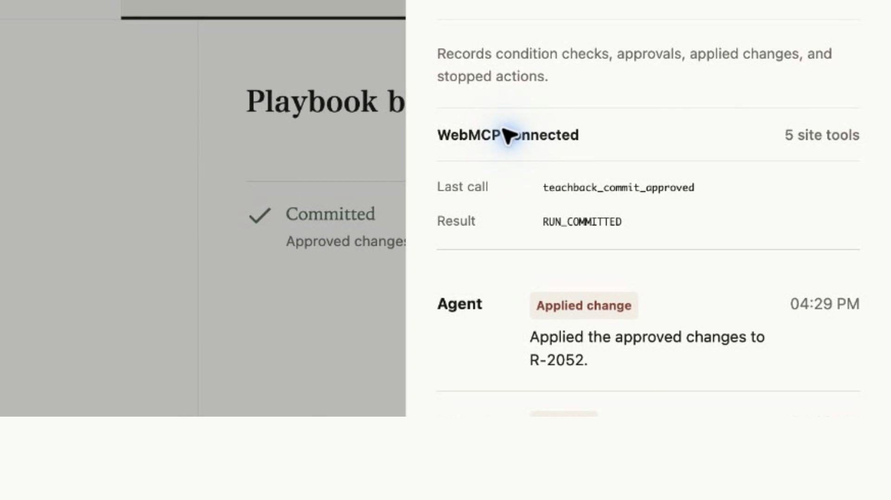

# Screenshots from the final video

These five PNGs are unmodified 1920×1080 frames from the accepted 94-second
English MP4. They retain its camera framing and captions; no additional crops,
labels, or simulated UI have been added. They are video stills, not fresh
screenshots of today's live site.

Use the order below for a gallery. If the form has fewer slots, prioritize
1, 3, 4, and 5: the human boundary, refusal, approval, and application.
The signed-in submission form permits up to 15 JPG/PNG/GIF images, each at most
5 MB, and recommends (but does not require) a 3:2 ratio. All five images and
captions were saved and their narrative order rechecked after reload on 2026-08-30.

## 1. Human-set boundary — 00:33.400

Suggested caption: **A person changes compensation handling to escalation before publishing the reusable rule.**

This still shows the confirmed state, not the change by itself. The surrounding
video shows the before/after transition.

## 2. Reuse for a different case — 00:53.200

Suggested caption: **Sofia's taught workflow prepares six changes for Daniel. Preparation applies nothing.**

## 3. Website refusal — 01:00.600

Suggested caption: **The real WebMCP application call returns RUN_NOT_APPROVED before human approval.**

## 4. Exact-proposal approval — 01:10.800

Suggested caption: **Approval is tied to this proposal, expires after five minutes, and may be used once.**

The displayed clock time is from the recording; it is not a currently valid
approval. The frame retains the video's sentence-fragment caption unchanged.

## 5. Approved application — 01:23.500

Suggested caption: **After approval, the retry returns RUN_COMMITTED and the audit records changes applied to Daniel.**

The full run ID and digest are not visible in these stills. The identical
arguments used before and after approval are documented in the
[capture record](../video-shoot/RECORDING-STATUS.md).

## Provenance

Source: `Teachback-WebMCP-94s-English.mp4`.

SHA-256: `49d1e05cb3e77f7a9413bbf83b01e0d377b6820565d41e0263ab19e5e1425d26`.

The [manifest](screenshots/manifest.json) records the source location, frame
indices, timestamps, and individual PNG hashes. These gallery images are
separate from the new 3:2 [Devpost cover](devpost-cover-final.png). The older
[`public/devpost-thumbnail.png`](../../public/devpost-thumbnail.png) remains
unchanged in the repository; it is no longer the cover used by the submitted entry.
